# Cinema Mode Authored-Knowledge Redesign

## Technical implementation plan for a bounded Predictive Documentary Author

Status: design only. This document does not authorize or contain a runtime migration.

Baseline snapshot: `Backups/CinemaAuthoredKnowledge-2026-07-28`

## 1. Decision and scope

The authored system should be redesigned around semantic propositions, persistent documentary memory, typed story situations and revisable editorial intentions. It should no longer grow mainly by adding phrase families directly to one narration selector.

The existing deterministic narrator remains valuable. It is the safe baseline, the source of proven sentence fragments, and the rollback implementation. The redesign moves it to the end of a clearer pipeline:

```text
authoritative evidence
→ propositions and claims
→ situations and story threads
→ predictions and audience obligations
→ editorial candidates
→ selection and commitment
→ narration/camera contracts
→ authored linguistic realisation
→ measured outcome
```

This is not a plan to give the simulation entities human dialogue, to let an LLM decide facts, or to duplicate the complete simulation inside Cinema Mode. It is a plan for a bounded documentary observer which:

- knows exactly which evidence supports each claim;
- distinguishes observation, deterministic derivation, hypothesis and prediction;
- remembers what it has already shown and said;
- recognises a developing situation over multiple timescales;
- predicts a small set of plausible near-future developments;
- chooses silence as readily as speech;
- coordinates camera and narration around the same editorial intention;
- measures whether its choice improved the programme;
- adjusts only bounded, reversible parameters from accumulated evidence.

The optional LLM remains outside this redesign. It may later realise validated narration contracts, but it must not own evidence interpretation, story selection, prediction, camera direction, correction or memory.

## 2. What is being replaced

The current implementation has several strong pieces:

- canonical documentary records and an append-only recorder;
- evidence, biography, promise and prediction ledgers;
- story-thread states and phases;
- an editorial activity classifier;
- a camera shot state machine and feasibility checks;
- controlled narration packets, validation and deterministic fallback;
- deterministic passages spanning many Laboratory domains;
- semantic repetition fingerprints and recent-topic memory;
- Cinema presets, subject continuity, favourites and information lenses;
- live companion, OBS, TTS and export integration.

The weakness is orchestration. Important logic remains distributed among `src/app.js`, the deterministic language library and the documentary runtime. Current narration can retrieve a large amount of data, but it does not yet consistently model:

- why a fact is worth communicating now;
- whether the audience already understands it;
- whether an unchanged state is genuinely new information;
- what question a situation has opened;
- which later observation would resolve that question;
- how a current event relates to a prior encounter;
- whether a prediction is calibrated;
- whether following this thread is outperforming other available coverage;
- how the selected camera shot supports the intended claim.

The redesign therefore replaces the direct relationship between scene selection and prose construction. It does not initially remove the renderer, the current camera controller, the recording system or the UI.

## 3. Architectural boundaries

```mermaid
flowchart LR
    S["Authoritative simulation"] --> A["Evidence adapters"]
    A --> B["Documentary evidence bus"]
    B --> I["Scientific interpreter"]
    I --> P["Proposition and claim store"]
    P --> W["Documentary world model"]
    W --> T["Situation and thread manager"]
    T --> R["Bounded predictor registry"]
    R --> G["Editorial candidate generator"]
    M["Audience model"] --> G
    X["Author self-model"] --> G
    G --> Q["Eligibility and scoring"]
    Q --> C["Commitment manager"]
    C --> N["Narration contract"]
    C --> K["Camera intention"]
    N --> L["Deterministic language realiser"]
    K --> D["Adaptive shot director"]
    L --> O["Voice and captions"]
    D --> O
    O --> E["Outcome evaluator"]
    E --> X
    E --> Z["Bounded correction"]
    Z --> Q
```



### 3.1 Simulation boundary

The simulation is the sole owner of physical and social truth. Documentary code may read snapshots and receive events. It must never change animal needs, decisions, relationships, resource availability, weather, terrain or event outcomes to create a better story.

### 3.2 Interpretation boundary

Raw state becomes a proposition only through a registered interpreter with declared evidence requirements. The phrase renderer cannot independently reinterpret scalar fields.

### 3.3 Authorship boundary

The author chooses an editorial action. It does not write surface prose. Its output is a contract containing claims, uncertainty, function, audience purpose and visual requirements.

### 3.4 Realisation boundary

The deterministic language system renders a contract. It may vary syntax, vocabulary, ordering and cadence, but cannot add a proposition, causal claim, prediction or named subject absent from the contract.

### 3.5 Presentation boundary

Camera and voice are scheduled together. Neither is allowed to silently change editorial subject while the other still presents the old contract.

## 4. Package structure

The target structure should be introduced beside the current system:

```text
src/documentary-author/
  evidence/
    evidence-schema.js
    evidence-bus.js
    evidence-adapter-registry.js
    threshold-detectors.js
    episode-detectors.js
    adapters/
      behaviour-adapter.js
      physiology-adapter.js
      perception-adapter.js
      relationship-adapter.js
      reproduction-adapter.js
      population-adapter.js
      hydrology-adapter.js
      vegetation-adapter.js
      weather-adapter.js

  interpretation/
    proposition-schema.js
    proposition-store.js
    claim-ledger.js
    scientific-interpreter.js
    causal-chain-registry.js
    uncertainty-policy.js

  world-model/
    documentary-world-model.js
    entity-documentary-record.js
    location-documentary-record.js
    process-documentary-record.js
    relationship-documentary-record.js
    salience-index.js

  situations/
    situation-schema.js
    situation-manager.js
    situation-pattern-registry.js
    patterns/
      resource-journey.js
      recovery.js
      hunt.js
      threat-response.js
      social-exchange.js
      courtship.js
      parental-care.js
      group-change.js
      hydrological-change.js
      vegetation-pressure.js

  prediction/
    prediction-schema.js
    predictor-registry.js
    prediction-ledger.js
    calibration.js
    predictors/
      resource-journey-predictor.js
      recovery-predictor.js
      hunt-phase-predictor.js
      social-outcome-predictor.js
      environmental-process-predictor.js
      camera-risk-predictor.js

  memory/
    audience-model.js
    author-self-model.js
    semantic-memory.js
    question-ledger.js
    introduction-ledger.js
    continuity-ledger.js

  editorial/
    editorial-candidate-schema.js
    candidate-generator.js
    candidate-eligibility.js
    candidate-scorer.js
    commitment-manager.js
    silence-candidate.js
    deferred-opportunity-queue.js
    schedule.js

  contracts/
    narration-contract.js
    camera-intention.js
    presentation-contract.js
    contract-validator.js

  language/
    authored-unit-schema.js
    authored-unit-registry.js
    semantic-planner.js
    discourse-planner.js
    clause-realiser.js
    lexical-variation.js
    deterministic-surface-realiser.js

  camera/
    adaptive-shot-director.js
    shot-candidate-generator.js
    shot-quality-evaluator.js
    predicted-action-zone.js
    continuity-policy.js

  evaluation/
    outcome-schema.js
    outcome-evaluator.js
    error-decomposer.js
    correction-engine.js
    longitudinal-metrics.js

  trace/
    author-trace.js
    replay-runner.js
    counterfactual-runner.js

  predictive-documentary-author.js
```

Existing files remain active until the migration gates in section 20 pass.

## 5. Evidence model

### 5.1 Evidence is immutable

Every input is an immutable transition record:

```js
{
  evidenceId: "ev-000192",
  schemaVersion: 1,
  tick: 918220,
  simulationTimeMinutes: 17642,
  observedAtRecordingMs: 231442,
  type: "physiology.capacity_threshold_crossed",
  subjects: ["ridge-hunter-17"],
  location: { cellId: "cell-920", x: 31.4, z: -18.1 },
  provenance: {
    producer: "metabolic-system",
    sourceClass: "AUTHORITATIVE_STATE",
    sourceRecordIds: ["trace-991"],
    observerLimit: "OMNISCIENT_SIMULATION"
  },
  magnitude: 0.67,
  confidence: 1,
  payload: {
    capacity: "burst",
    transition: "ABOVE_TO_BELOW_REQUIRED",
    previous: 0.34,
    current: 0.14,
    required: 0.31,
    retainedCapabilities: ["walk", "slow_trot"],
    causalDebts: { anaerobic: 0.71, thermal: 0.22, hydration: 0.08 }
  }
}
```

Evidence records are never rewritten. Corrections add new records. This preserves replay determinism and prevents a later interpretation from changing what was originally observed.

### 5.2 Prefer transitions over samples

Continuous values are banded with hysteresis. For a scalar value `x`, enter a high band only when `x ≥ h_enter` and leave it only when `x ≤ h_exit`, where `h_exit < h_enter`. This prevents narration opportunities from oscillating around one boundary.

For example:

```text
high dehydration enters at 0.75
high dehydration exits at 0.68
```

The detector emits:

- threshold crossed;
- meaningful slope changed;
- capability gained or lost;
- objective changed;
- episode started, progressed, interrupted or resolved;
- relationship or population band changed;
- environmental causal process crossed a significant stage.

Periodic samples remain available for research summaries, but they do not directly produce speech candidates.

### 5.3 Evidence volume control

Let raw rate be `R_raw`, coalescing ratio be `c`, threshold yield be `t`, and episode yield be `e`. Documentary input rate is:

```math
R_doc = R_raw(c + t + e)
```

The target is not a fixed global number. Each adapter receives a per-domain budget and must report dropped, coalesced and emitted counts. Critical events—birth, death, contact attack, group split and irreversible environmental transition—cannot be dropped.

### 5.4 Required adapters

The first complete adapter inventory must include every authoritative domain currently exposed in Laboratory Main:

- identity, age, sex, life stage and lineage;
- current action, objective, plan phase and interruption reason;
- needs, satisfiers, acquisition plans and forecast viability;
- gut contents, accessible fuel, fat, functional protein, muscle glycogen and aerobic capacity;
- fatigue, anaerobic debt, thermal debt, stress debt and recovery depth;
- adrenaline availability, mobilisation, consequence and damage;
- hydration, water route, contact and drinking outcome;
- temperature, terrain contact and thermoregulatory response;
- health, injury, body condition and observable expression;
- vision, hearing, smell, attention, confidence and uncertainty;
- memories, provenance, decay and contradiction;
- calls, public signals, receivers and knowledge transfer;
- kinship, familiarity, friendship, dominance, hostility, care and bereavement;
- female preferences, male strategy, courtship, rejection, mating, pregnancy and parental care;
- hunting phase, prey evidence, awareness, pursuit, contact, escape, kill and carcass use;
- group formation, leadership, migration, split, merge and territorial dispute;
- plant biomass, grazing, regrowth, succession, fallen wood and seed movement;
- rainfall, runoff, infiltration, water depth, discharge, mud, drying, flooding and sediment;
- weather, season and climate trends;
- births, deaths, population structure, resource stocks and longitudinal anomalies.

“No data left uncommentable” should mean every domain can become evidence and a valid proposition—not that every field must produce speech.

## 6. Proposition and claim system

### 6.1 Separate facts from wording

A proposition is language-independent:

```js
{
  propositionId: "prop-441",
  subjectIds: ["grazer-88"],
  predicate: "objective_continues_at_sustainable_pace",
  arguments: {
    objective: "reach_water",
    currentPace: "walk",
    lostCapability: "sprint"
  },
  epistemicClass: "DETERMINISTIC_DERIVATION",
  confidence: 1,
  support: ["ev-781", "ev-792", "ev-799"],
  contradiction: [],
  validity: { fromTick: 918220, untilTick: null },
  materiality: 0.72
}
```

The same proposition may be realised as observation, explanation, contrast, reminder, question setup or later resolution.

### 6.2 Epistemic classes

Use a closed enumeration:

```text
DIRECT_OBSERVATION
AUTHORITATIVE_STATE
DETERMINISTIC_DERIVATION
STRONG_ASSOCIATION
EDITORIAL_HYPOTHESIS
BOUNDED_PREDICTION
REPORTED_BY_ENTITY_SIGNAL
UNKNOWN
```

Each class has an allowed language policy. `AUTHORITATIVE_STATE` permits direct declaratives. `EDITORIAL_HYPOTHESIS` requires modal language. `REPORTED_BY_ENTITY_SIGNAL` must name or imply the information source. `UNKNOWN` normally permits only questions or silence.

### 6.3 Claims are versioned

A claim ledger stores the currently supportable interpretation and its revisions:

```js
{
  claimId: "claim-441",
  revision: 3,
  propositionId: "prop-441",
  status: "SUPPORTED",
  confidence: 0.91,
  alternatives: [
    { predicate: "objective_abandoned", confidence: 0.06 }
  ],
  firstSupportedAtTick: 918220,
  updatedAtTick: 918226,
  expiresAtTick: 918256
}
```

Revision is append-only. The current view is an index over revisions.

### 6.4 Causal claims

`A caused B` is allowed only when a registered causal interpreter provides one of:

- direct causal event identity;
- deterministic simulation transition;
- an explicitly bounded association with alternatives.

Correlation alone cannot become deterministic causal prose. A causal-chain record must include nodes, directed edges, evidence and unresolved links.

## 7. Documentary world model

The world model is a compressed author-facing representation, not a second simulation.

```js
class DocumentaryWorldModel {
  entities = new Map();
  relationships = new Map();
  locations = new Map();
  processes = new Map();
  situations = new Map();
  activeClaims = new Map();
  uncertainties = new Map();
}
```

Records retain only:

- present documentary state;
- notable changes;
- active capabilities and constraints;
- unresolved objectives;
- significant relationships;
- active processes;
- evidence links;
- uncertainty;
- relevance indexes.

The world model must have bounded size. Old resolved detail is reduced to an episode summary containing participants, outcome, causes, consequences and evidence references.

## 8. Situations and social practices

Events are too small and broad “stories” are too vague. The central unit should be a typed situation.

```js
{
  situationId: "situation-water-journey-12",
  type: "RESOURCE_JOURNEY",
  phase: "OBSTRUCTION",
  roles: {
    traveller: "grazer-88",
    destination: "waterhole-west",
    blocker: "grazer-31"
  },
  objectives: ["reach_water"],
  tensions: ["hydration_worsening", "social_displacement"],
  openedAtTick: 918100,
  lastChangedAtTick: 918226,
  evidenceIds: [],
  openQuestions: [],
  possibleTransitions: []
}
```

Situation patterns formalise recurring ecological practices:

- resource journey;
- recovery episode;
- hunt;
- escape;
- carcass competition;
- communal feeding;
- territorial defence;
- courtship and mate assessment;
- parental care;
- group travel;
- group split or reunion;
- dominance challenge;
- bereavement response;
- hydrological chain;
- vegetation pressure and recovery;
- weather-driven redistribution.

Participants may hold several roles simultaneously. A female may be traveller, mother, subordinate competitor and threat observer. The situation manager records role pressure; the simulation remains responsible for the actual decision.

## 9. Story threads and deferred opportunities

A story thread groups related situations and persists through dormancy:

```text
CANDIDATE → DEVELOPING → ACTIVE → DORMANT → RETURN_READY
                         ↘ RESOLVED → CONSEQUENCE → ARCHIVED
                         ↘ INVALIDATED
```

Each thread owns:

- central question;
- primary and supporting subjects;
- current situation and phase;
- established facts;
- interpretations;
- pending predictions;
- communicated claims;
- missing coverage;
- resolution criteria;
- return triggers;
- editorial value.

Narration opportunities use a deferred queue. A significant birth may remain pending while a hunt resolves. Its later realisation can explicitly bridge time: “While the hunt held our attention…” The queue entry carries an expiry condition; stale remarks do not survive indefinitely.

## 10. Audience model

Audience memory is not the same as event history. It estimates what the programme has actually communicated.

```js
{
  propositionId: "prop-441",
  exposureCount: 2,
  firstCommunicatedAtMs: 30120,
  lastCommunicatedAtMs: 88220,
  channels: ["NARRATION", "CAPTION", "VISIBLE_ACTION"],
  estimatedComprehension: 0.78,
  estimatedRetention: 0.69,
  lastWordingFamily: "capacity_contrast",
  changeSinceCommunication: 0.12
}
```

Retention can decay exponentially:

```math
R(t) = R_0 e^{-\lambda \Delta t}
```

where `λ` depends on importance, repetition, visual reinforcement and complexity. This is an editorial estimate, not a claim about a real viewer’s mind.

A proposition is eligible for restatement only when at least one is true:

- its truth value changed;
- magnitude crossed a meaningful band;
- its cause changed;
- its consequence became visible;
- a new subject makes the mechanism relevant;
- it resolves an open question;
- retention fell below a configured threshold and the fact is needed now;
- a contrast with the earlier state creates new meaning.

Paraphrasing an unchanged fact does not count as novelty.

## 11. Questions and hypotheses

Questions require a lifecycle:

```text
PROPOSED → OPEN → PARTIALLY_ANSWERED → RESOLVED
                       ↘ EXPIRED
                       ↘ INVALIDATED
```

```js
{
  questionId: "question-92",
  textIntent: "whether_detour_preserves_water_objective",
  threadId: "thread-water-12",
  openedByClaims: ["claim-obstruction", "claim-hydration"],
  admissibleAnswers: ["DETOUR", "CONFRONT", "REST", "ABANDON"],
  requiredEvidenceTypes: ["behaviour.started", "objective.changed"],
  expiresAtTick: 918300,
  spoken: true
}
```

Questions must not be decorative. If spoken, they create an editorial obligation to seek evidence and, where worthwhile, communicate the answer.

A hypothesis similarly records support, alternatives, disconfirmation criteria and calibration class. The author may not silently convert a hypothesis into fact.

## 12. Bounded prediction

Predictors are specialised and inspectable. No universal predictor attempts to infer the entire ecosystem.

```js
{
  predictionId: "pred-118",
  predictor: "resource-journey-v1",
  situationId: "situation-water-journey-12",
  outcomes: [
    { id: "DETOUR", probability: 0.48 },
    { id: "DISPLACEMENT", probability: 0.31 },
    { id: "RECOVERY_STOP", probability: 0.21 }
  ],
  horizon: { minTicks: 1, maxTicks: 12 },
  assumptions: ["destination_remains_available"],
  evidenceIds: [],
  issuedAtTick: 918226,
  status: "ACTIVE"
}
```

Probabilities must sum to one within tolerance. Predictors can abstain. Initial predictors should use deterministic tables or bounded logistic models.

For binary outcome probability:

```math
p(y=1|x)=\frac{1}{1+e^{-(\beta_0+\sum_i \beta_i x_i)}}
```

Coefficients are configuration, versioned and tested. They are not modified live at first.

Calibration is measured with Brier score:

```math
BS = \frac{1}{N}\sum_{i=1}^{N}(p_i-o_i)^2
```

and by reliability buckets. A predictor with poor calibration is down-weighted or disabled, not allowed to generate more confident wording.

## 13. Author self-model

The functional self contains only editorial state:

```js
{
  currentFocus: { threadId, situationId, subjects, sinceTick, reason },
  currentInterpretation: { claimIds, function, confidence },
  activePredictions: [],
  commitments: [],
  pendingActions: [],
  coverageGaps: [],
  performance: {
    currentShotId,
    currentSpeechId,
    narrationDensity60s,
    audienceLoad,
    recentConcepts,
    recentStructures,
    cameraMotionLoad
  },
  selectionHistory: [],
  errorHistory: []
}
```

This model supports self-prediction: “If I remain here for eight seconds, this thread is likely to resolve on camera; if I switch, the audience gains novelty but may lose the causal outcome.” It is not consciousness or unrestricted introspection.

## 14. Editorial candidates

Generate a small, typed set each author cycle:

```text
FOLLOW_THREAD
SWITCH_THREAD
WIDEN_CONTEXT
SHOW_REACTION
SHOW_CAUSE
SHOW_CONSEQUENCE
INTRODUCE_SUBJECT
EXPLAIN_MECHANISM
ASK_QUESTION
RESOLVE_QUESTION
CORRECT_CLAIM
DEFER_OPPORTUNITY
RETURN_TO_THREAD
REMAIN_SILENT
```

Candidate formation and candidate selection are separate. Formation defines what actions exist. Eligibility removes unsafe or impossible actions. Scoring ranks the rest.

Hard eligibility examples:

- all claims have valid support;
- subjects exist and match identity constraints;
- required camera evidence is feasible;
- no forbidden epistemic promotion;
- narration does not collide with active speech;
- a question has a possible evidence path;
- a correction references the claim being corrected;
- an action does not exceed density or motion safety limits.

## 15. Selection mathematics

For eligible action `a` in context `s`, use a transparent utility:

```math
U(a,s)=
w_nN+w_rR+w_cC+w_eE+w_vV+w_pP+w_qQ+w_hH
-w_dD-w_lL-w_iI-w_uU-w_mM
```

Where:

- `N`: semantic novelty to the audience;
- `R`: relevance to active thread;
- `C`: causal or explanatory contribution;
- `E`: emotional/ecological significance;
- `V`: visual feasibility;
- `P`: predicted information gain;
- `Q`: question or promise resolution value;
- `H`: continuity and historical payoff;
- `D`: semantic duplication;
- `L`: cognitive/narration load;
- `I`: interruption cost;
- `U`: epistemic uncertainty penalty;
- `M`: camera movement/disorientation cost.

All components are normalised to `[0,1]`. Scores must be recorded individually in traces.

The silence candidate receives positive utility:

```math
U(silence)=w_bB+w_aA+w_tT-w_gG
```

where `B` is breathing-room value, `A` is ambient visual strength, `T` is tone protection and `G` is cost of leaving an important audience gap. Silence therefore wins legitimately instead of appearing only when no phrase matched.

## 16. Commitment and switching hysteresis

The author should not oscillate between attractive events. A switch requires:

```math
U(new)-U(current) > \theta_{base}+\theta_{commitment}+\theta_{speech}+\theta_{continuity}
```

Thresholds fall when:

- the current thread resolves;
- visual quality collapses;
- its prediction is contradicted;
- no new information arrives;
- a critical event occurs elsewhere.

Thresholds rise when:

- an open question is near resolution;
- current narration is speaking;
- a causal chain would be broken;
- a rare interaction is unfolding;
- the camera is already positioned for a likely outcome.

Commitments have maximum durations and explicit break conditions. They prevent indecision, not reconsideration.

## 17. Narration contracts and authored units

The author produces a semantic contract:

```js
{
  contractId: "narr-204",
  function: "EXPLANATION",
  threadId: "thread-water-12",
  focalClaims: ["claim-441"],
  supportingClaims: ["claim-anaerobic-debt"],
  contrastWithAudienceMemory: "previously_sprinting_now_walking",
  epistemicPolicy: "DETERMINISTIC_ONLY",
  discoursePlan: ["OBSERVATION", "CAUSE", "CONSEQUENCE"],
  targetSeconds: 11,
  maximumSentences: 3,
  prohibitedConcepts: ["collapse", "objective_abandoned"],
  visualRequirements: ["SHOW_FORWARD_MOVEMENT"],
  completionObligations: [],
  evidenceIds: []
}
```

Authored knowledge is stored as semantic units rather than complete monolithic sentences:

```js
{
  unitId: "capacity.sprint_lost_walk_retained.v1",
  realises: "objective_continues_at_sustainable_pace",
  requires: ["lostCapability:sprint", "retainedCapability:walk"],
  functions: ["OBSERVATION", "EXPLANATION", "CONTRAST"],
  epistemicClasses: ["AUTHORITATIVE_STATE", "DETERMINISTIC_DERIVATION"],
  clauses: {
    observation: ["{subject} has dropped to a walk"],
    contrast: ["The burst has ended, but the journey has not"],
    cause: ["Walking remains within {possessive} aerobic capacity"],
    consequence: ["The destination is still reachable if conditions hold"]
  },
  lexicalTags: ["physiology", "capacity", "journey"],
  cooldown: { semanticSeconds: 90, structuralSeconds: 35 },
  incompatibilities: ["claim:objective_abandoned"]
}
```

### 17.1 Surface realisation stages


This supports coherent passages without unrestricted text generation. The discourse planner can join clauses with bounded rhetorical relations:

- sequence;
- cause;
- contrast;
- concession;
- consequence;
- recurrence;
- correction;
- question and resolution.

### 17.2 Specificity cascade

Eligible units receive specificity points for each satisfied optional condition. A highly specific unit wins only if its facts are supported. General units remain as fallback.

```math
S(unit)=\sum requiredMatch + \alpha\sum optionalMatch - penalties
```

Personality should belong to the documentary narrator, not the animals. Style profiles alter diction and rhythm but never proposition selection.

### 17.3 Repetition model

Track repetition at four levels:

- exact rendered string;
- clause template;
- semantic proposition;
- rhetorical structure.

Semantic duplication carries the largest penalty. Saying the same fact three different ways remains repetition.

## 18. Adaptive camera intentions

The editorial author issues a revisable intention rather than a fixed shot list:

```js
{
  intentId: "camera-781",
  purpose: "show_social_obstruction_of_water_journey",
  primarySubjects: ["grazer-88"],
  secondarySubjects: ["grazer-31"],
  relationship: "SHARED_FRAME_WITH_ROUTE",
  predictedActionZone: { x: 31, z: -18, radius: 14 },
  preferredShotSizes: ["WIDE", "MEDIUM_WIDE"],
  visualRequirements: ["SHOW_ROUTE", "SHOW_BOTH_SUBJECTS"],
  avoid: ["IMPLY_COLLAPSE", "HIDE_DESTINATION_DIRECTION"],
  minimumHoldSeconds: 4,
  preferredHoldSeconds: 12,
  breakConditions: ["AGGRESSION_STARTED", "ROUTE_CHANGED", "CRITICAL_EVENT"]
}
```

### 18.1 Three update rates

- Every frame: interpolation, collision, terrain clearance, target tracking and final framing.
- 5–10 Hz: visibility, occlusion forecast and composition repair.
- 2–5 Hz: shot candidates, phase adaptation and predicted action zone.
- 1–2 Hz: editorial stay/switch decision and narration coordination.
- Immediate interrupts: death, birth, attack contact, subject loss or invalid camera pose.

### 18.2 Shot quality

```math
Q_{camera}=w_vV+w_cC+w_rR+w_bB+w_pP+w_nN-w_oO-w_mM-w_dD
```

Where visibility, composition, relevant-subject inclusion, behavioural legibility, predictive preparedness and narrative usefulness are rewarded; occlusion, movement and disorientation are penalised.

Evaluate current quality and short-horizon predicted quality. A lateral repair may beat a cut even when the cut has slightly higher raw visibility because continuity is valuable.

### 18.3 Camera and narration contract

While narration speaks:

- no unrelated subject switch;
- no rapid cut unless a critical event overrides;
- referenced subjects remain visible where feasible;
- the frame must not contradict the spoken proposition;
- queued generic narration pauses;
- captions and voice use the same contract lifecycle.

If required visuals are unavailable, defer the line, weaken it according to epistemic policy, or remain silent.

## 19. Outcome evaluation and correction

Every editorial action records predicted and actual outcomes:

```js
{
  decisionId: "decision-301",
  action: "FOLLOW_THREAD",
  predicted: {
    informationGain: 0.72,
    resolutionProbability: 0.61,
    cameraQuality: 0.82,
    interruptionRisk: 0.12
  },
  actual: {
    newClaimsShown: 2,
    questionResolved: true,
    cameraQualityMean: 0.79,
    semanticDuplication: 0,
    criticalEventsMissed: 0
  }
}
```

Errors are decomposed:

```text
EVIDENCE_ERROR
INTERPRETATION_ERROR
PREDICTION_ERROR
CANDIDATE_FORMATION_ERROR
SELECTION_ERROR
COMMITMENT_ERROR
SWITCHING_ERROR
COMPOSITION_ERROR
EXECUTION_ERROR
NARRATION_REALISATION_ERROR
AUDIENCE_MODEL_ERROR
STATE_SPACE_ERROR
METASELECTION_ERROR
```

Correction begins conservatively:

1. record errors without adaptation;
2. calibrate predictor confidence offline;
3. adjust bounded thresholds between sessions;
4. compare against baseline replays;
5. accept only improvements satisfying guardrails;
6. retain the previous parameter set for rollback.

No live rewriting of authored knowledge is allowed. Metaselective changes require repeated patterns over many episodes, not a single failure.

## 20. Migration plan

### Phase 0 — Freeze and characterise baseline

Use the snapshot as the immutable baseline. Add replay fixtures from representative sessions: hunt, recovery, water journey, courtship, birth, group change, rainfall/runoff and quiet landscape.

Exit gate: baseline output, timing, repetition and camera behaviour can be reproduced.

### Phase 1 — Evidence adapters

Implement schemas, bus, coalescing and threshold detectors behind a disabled feature flag. Mirror current documentary events without affecting selection.

Exit gate: deterministic evidence output; bounded memory; every record validates; no simulation mutation.

### Phase 2 — Propositions and epistemic policy

Implement interpreters for physiology, action, perception, relationships and world processes. Add claim versioning and causal chains.

Exit gate: every rendered factual clause can identify supporting proposition and evidence IDs.

### Phase 3 — Audience memory and semantic repetition

Record communicated propositions, introductions, open questions and discourse structures. Continue using the current scene selector.

Exit gate: unchanged-state paraphrase repetition falls materially without reducing significant-event coverage.

### Phase 4 — Situations and story threads

Build typed situation patterns and thread lifecycle. Feed current narration through the active thread.

Exit gate: multi-stage episodes retain identity across interruption and dormancy.

### Phase 5 — Semantic contracts and new deterministic realiser

Introduce narration contracts, authored semantic units and discourse planning. Run old and new renderers side by side; only old output is audible initially.

Exit gate: the new renderer never introduces unsupported claims and meets duration bounds.

### Phase 6 — Bounded predictors

Add rule-based recovery, journey, hunt, social and environmental predictors. Predictions are logged but not spoken or used for camera selection.

Exit gate: minimum sample count and acceptable calibration per predictor.

### Phase 7 — Predictive editorial selection

Add candidates, explicit silence, transparent utility, deferred opportunities and commitments. Shadow-score the current director before enabling it.

Exit gate: replay comparison improves new-information rate and thread resolution without increasing missed critical events.

### Phase 8 — Adaptive camera intentions

Translate selected meaning into revisable camera intentions. Keep the existing physical camera controller as executor.

Exit gate: improved visual requirement satisfaction, fewer unnecessary cuts and no camera safety regressions.

### Phase 9 — Outcome evaluation

Record decision predictions, actual presentation quality and error classes. Produce a replay/audit report.

Exit gate: every selection can be explained from recorded inputs and scores.

### Phase 10 — Bounded correction

Permit between-session adjustment of a small allowlist of thresholds and calibration maps. Require automatic comparison and rollback.

Exit gate: repeated multi-seed improvement with guardrails.

### Phase 11 — Remove obsolete orchestration

Only after sustained acceptance should direct scene-to-prose orchestration be removed from `src/app.js`. Keep an adapter allowing the baseline snapshot system to run as “Legacy deterministic documentary.”

## 21. Feature flags and rollback

```js
{
  evidenceBusV2: false,
  propositionStoreV2: false,
  audienceMemoryV2: false,
  situationThreadsV2: false,
  semanticRealiserV2: false,
  predictorsV2: false,
  predictiveSelectionV2: false,
  adaptiveCameraV2: false,
  boundedCorrectionV2: false
}
```

Flags are independently selectable for ablation. A top-level mode chooses:

```text
LEGACY
V2_SHADOW
V2_ACTIVE
```

`V2_SHADOW` executes V2, records its decisions, but presents Legacy output. This is the main migration safety mechanism.

Rollback is triggered by:

- unsupported factual claim;
- narration contradiction above zero tolerance;
- missed critical-event rate above baseline tolerance;
- camera safety regression;
- unbounded queue or memory growth;
- nondeterministic replay;
- performance budget violation;
- corrupt documentary export.

## 22. Testing

### Unit tests

- schemas reject incomplete or invalid evidence;
- hysteresis emits one transition, not repeated chatter;
- claims preserve evidence provenance;
- epistemic class limits wording;
- predictors normalise probabilities and abstain safely;
- semantic units cannot introduce absent arguments;
- silence competes in scoring;
- commitment thresholds prevent oscillation;
- question resolution requires admissible evidence;
- camera intentions cannot request unknown subjects.

### Property tests

- no finite input creates non-finite score;
- queues and ledgers remain bounded;
- probabilities remain `[0,1]` and sum correctly;
- replay order is deterministic for equal tick/order keys;
- narration contains only contract entities and quantities;
- all corrections retain the superseded version.

### Epistemic tests

- private simulation truth is not described as visually observed;
- reported calls do not become direct predator sightings;
- uncertain motive does not become intention;
- association does not become cause;
- prediction does not become outcome before evidence;
- correction explicitly supersedes earlier interpretation.

### Temporal tests

- unchanged conditions are not repeatedly narrated;
- meaningful recovery creates a new contrast;
- dormant threads return with a concise reminder;
- deferred opportunities expire correctly;
- questions resolve or expire;
- narration scheduler prevents overlapping voices.

### Counterfactual and ablation tests

Replay identical evidence with:

- audience memory disabled;
- prediction disabled;
- commitment disabled;
- silence disabled;
- adaptive camera disabled;
- correction disabled.

Measure which subsystem produces each improvement.

### Long-session metrics

- semantic repetition rate;
- exact and structural repetition rate;
- percentage of lines adding a new proposition;
- significant-event capture rate;
- false-certainty and unsupported-claim count;
- abandoned and resolved thread rates;
- unresolved spoken-question rate;
- correction rate;
- narration density and silence distribution;
- average dwell and rapid-switch count;
- visual-requirement satisfaction;
- camera occlusion and disorientation;
- prediction calibration;
- memory, CPU and event-throughput budgets.

### Adversarial scenarios

- hundreds of simultaneous transitions;
- prolonged quiet world;
- rapid reversals around thresholds;
- similar-looking entities;
- subject death during narration;
- prediction repeatedly fails;
- contradiction arrives during speech;
- active thread resolves off-camera;
- TTS interruption;
- camera loses both subjects;
- recording or companion disconnects.

## 23. Performance budgets

The author must never scan the entire simulation every frame. Suggested initial budgets on the target machine:

```text
evidence ingestion: event-driven, ≤ 1.0 ms per simulation tick typical
interpretation batch: ≤ 2.0 ms at 2–5 Hz
author cycle: ≤ 2.5 ms at 1–2 Hz
shot evaluation: ≤ 1.5 ms at 5–10 Hz
frame camera execution: ≤ 0.5 ms typical
active propositions: configurable hard cap
active situations/threads: hard cap with archival compaction
deferred opportunities: hard cap by priority and expiry
trace buffer: bounded, streamed to documentary recorder
```

All budgets require percentile reporting, not averages alone. Use p50, p95, p99 and maximum. Under overload, preserve critical evidence, current-thread evidence and camera safety; defer research summaries and low-priority opportunities.

## 24. UI and operator controls

The redesign should not expose dozens of internal weights in the ordinary Cinema panel. Presets configure policy bundles:

- Classic documentary;
- Character continuity;
- Ecological processes;
- World systems only;
- Complete Laboratory;
- Quiet observation;
- Event highlights;
- Research audit.

Advanced diagnostic UI may show:

- current thread and question;
- selected action and runner-up;
- claims and evidence;
- prediction probabilities;
- audience novelty estimate;
- commitment reason;
- silence reason;
- narration and camera contracts;
- last outcome and error class.

Every view must distinguish simulation truth from author belief and audience communication.

## 25. Documentation deliverables during implementation

Each phase must update:

- evidence type catalogue;
- proposition and epistemic policy reference;
- situation-pattern catalogue;
- predictor cards with assumptions and calibration;
- authored-unit style guide following Orwell/ASD-STE clarity constraints;
- camera intention vocabulary;
- feature-flag and rollback guide;
- trace/replay operator guide;
- performance and longitudinal validation report.

## 26. Definition of done

The redesign is complete only when all of the following are true:

1. Every spoken factual claim links to propositions and immutable evidence.
2. Surface prose cannot introduce unsupported facts.
3. Semantic repetition is measured and suppressed across paraphrases.
4. Persistent entity, relationship, location and process continuity works across long sessions.
5. Questions and predictions have explicit outcomes.
6. Silence is a scored editorial action.
7. Camera and narration share one presentation contract.
8. The camera revises framing as situations develop without unnecessary cuts.
9. Selection and switching decisions are traceable.
10. Outcome errors are decomposed rather than treated as one vague quality score.
11. Correction is bounded, versioned and reversible.
12. Six-hour synthetic sessions remain deterministic, bounded and free of unsupported claims.
13. V2 materially outperforms the frozen Legacy baseline on new-information rate, thread completion, repetition and visual coherence.
14. The Legacy system remains restorable from the preserved snapshot.

## 27. Recommended first implementation milestone

The first milestone should stop after Phase 3: evidence, propositions and audience memory running in shadow mode. That milestone creates the foundation and delivers immediate repetition improvements without entrusting a new system with camera or story selection.

Do not begin prediction, self-correction or adaptive camera direction until the system can answer these questions for every prospective sentence:

```text
What exact proposition would this sentence communicate?
Which immutable evidence supports it?
What epistemic wording is permitted?
Has the audience already received it?
What changed since then?
Why is this worth saying now?
```

Once those answers are reliable, the predictive author can be added without turning complexity into opacity.

